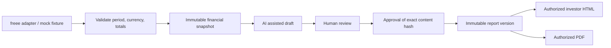

# Prorium Monthly Shareholder Report — Phase 1

## Outcome and scope

The first deliverable is a polished Japanese August 2026 investor report using synthetic data only. In 30 seconds investors see revenue, operating profit, ordinary profit, cash and a reviewed executive summary. In three minutes they can understand YoY movements, business drivers, AI revenue and efficiency, forward indicators and risks.

This repository implements the mock report and a production adapter for verified Supabase Auth, admin MFA, investor grants, monthly narrative editing, private financial documents, review/approval/publication, immutable revision snapshots, audit and PDF. The dedicated Vercel deployment exists and is protected; the dedicated Supabase, SMTP and live AI setup remain incomplete. Development and Preview use only synthetic data. See the [latest launch status](launch-readiness-2026-10-07.md) and [production acceptance gates](production-acceptance.md).

## 1. Architecture

Next.js App Router + TypeScript. Server Components perform authorization before fetching reports. Small client components handle chart selection, navigation, editing and downloads. A server-only repository provides a development JSON store with serialized writes and atomic replacement. It is single-process, mock-only storage, not a production database.

Domain types and calculations do not depend on a provider. Import and analysis provider interfaces permit freee and an AI provider later. Current adapters use synthetic fixtures and deterministic text. AI output never transitions to approved or published.

The production adapter uses a dedicated Supabase project, verified-email invitations, admin AAL2 MFA, PostgreSQL RLS and private PDF storage. Investor requests use their own verified access token and RLS; the application does not use a service-role key. Development and Preview cannot activate this adapter. freee OAuth and financial-analysis jobs remain future integration work.

Monthly owner notes are private and separate from investor content. AI generation first saves them, then requests a server-side draft; generation failures leave the original notes recoverable. Completion checks the exact revision of its own write and cannot overwrite another edit. Editorial drafting is always available. Shared client state blocks review/approval/publication for unsaved narrative edits and blocks conflicting mutations while processing; backend transactions remain the authority for revisions and publication.

## 2. Database schema

`database/schema.sql` and `database/production.sql` are mirrored in the two CLI-created initial migrations under `supabase/migrations/`. They have been executed in local PGlite tests but are **not applied to a production DB**. Any changes after application require a new migration; do not overwrite an applied initial migration.

| Table                     | Purpose and critical fields                                            |
| ------------------------- | ---------------------------------------------------------------------- |
| profiles                  | auth user identity and display name; no self-managed role              |
| private.admin_memberships | trusted server-provisioned admin membership                            |
| investor_grants           | user, company, grant/revocation timestamp                              |
| reports                   | company, monthly period, unique company-period                         |
| import_jobs               | source, synthetic flag, validation result, state                       |
| financial_snapshots       | immutable period, JPY data, source provenance, checksum                |
| report_versions           | report, snapshot, version, state, investor-safe content JSON, checksum |
| approval_events           | version, reviewer, approved checksum, timestamp                        |
| analysis_runs             | internal AI draft, provider/model, input checksum; admin only          |
| audit_logs                | append-only actor/action/record metadata; no raw financial payload     |
| private.ir_invitations    | confirmed email, role, active status, accepted stable Auth user ID |
| private.monthly_inputs    | admin-only owner notes, report version, updated time |
| ir_documents              | private Storage path, category, period, basis, size, checksum, upload state |

Store values in integer JPY; format as millions of yen on screen. YoY compares the same month, never sequential months. Zero or negative baselines display a delta, not a misleading percentage. Operating margin movement uses percentage points. cash is an end-of-month balance.

Future indicators have a mandatory enum: Actual, Committed, Forecast, Pipeline. A forecast or pipeline must not enter actual revenue totals. Version labels are `v1.0`, `v1.1`, `v2.0`; internal IDs are independent of labels. Published versions and their source snapshots never update or delete, even for an admin. Revisions clone into a new draft. Re-imports create new snapshots.

## 3. Security model

- Development accepts synthetic data only. There is no production financial data or credential in this repo.
- Mock is enabled only in development or an explicit local/Preview mock runtime. Vercel Production always rejects demo login even if a Mock flag is supplied. Production configuration requires the dedicated HTTPS origin, publishable key and company ID; Development/Preview cannot activate it.
- Mock sessions use a process-random HMAC key, HttpOnly/SameSite cookies, expiry and server-side role validation. Demo identities/passwords are intentionally public; they are not production authentication. A restart revokes sessions.
- Authorization is enforced at page, action, repository and PDF boundaries. Investor reads select only published versions. Preview/draft/admin/import/audit require an admin session. UI visibility is never the permission check.
- Every mutation uses Next.js Server Actions (origin checks), validates input and checks roles. Editing resets review/approval. Approving requires a review state; publishing requires approval of the same content hash. No automatic AI publication.
- PostgreSQL RLS is enabled on all report tables. Grant revocation takes effect via database lookup, not user-editable JWT metadata. Investor cannot read draft versions, snapshots, imports, approvals or audits. Private security-definer lookup functions are narrow, pinned to an empty search path and have explicit execute grants.
- SQL triggers enforce immutable publications/snapshots and append-only audit events. Client writes to membership/approvals/publication are revoked. A narrowly scoped backend worker must still pass workflow triggers.
- PDFs require authorization; the browser targets a configured loopback origin in Mock or the fixed `APP_ORIGIN` in Production, carries only the current app session cookies and blocks other origins. PDF requests never use untrusted Host headers as destinations. Authenticated rendering behind Vercel protection must pass actual acceptance.
- Personalized reports are dynamic and have private/no-store responses. No public report URLs, social previews with financial data, or public storage buckets.

## 4. UI information architecture

The report uses a fixed, restrained left rail on desktop and a compact mobile drawer. The investor archive is separate from administration. The header displays period, reporting basis, version and PDF. At the top: four large financial KPI cards, current value, YoY, status and a clearly labeled mock provenance strip. Then a short AI assisted executive summary reviewed by management.

01 Executive Summary → 02 Financial Performance → 03 Why It Changed → 04 Business Highlights → 05 AI Transformation → 06 Financial Position → 07 Forward Indicators → 08 Risks & Actions → 09 CEO Commentary.

Revenue trend compares the selected year with the prior year and uses minimal axes. Driver bridges reconcile exactly with total movements. AI as Revenue and AI as Efficiency have distinct cards and explain contribution versus attribution estimates. Risks pair likelihood/impact with action, owner and date. The CEO closes with a brief human statement. All example claims are synthetic.

## 5. Component structure

- `src/components/shell.tsx`: brand, global navigation, responsive rail, identity.
- `src/components/report/`: report renderer, KPI cards, provenance, executive summary, trend chart, driver bridges, AI impact, remaining sections, PDF action.
- `src/components/admin/`: monthly notes, report editor, unsaved-edit guard, workflow, financial entry, document uploads, investor invitations, synthetic import.
- `src/lib/domain/`: models, calculation, validation, workflow and AI/import contracts.
- `src/lib/server/`: runtime guards, mock sessions, verified Supabase authorization, mock/production repositories, monthly draft generation, private documents and PDF.
- `src/app/`: the requested routes with guarded server data access.
- `database/`: unapplied SQL sources; `supabase/migrations/`: matching initial migrations; `tests/`: domain, SQL/RLS and browser verification.

## 6. Implementation sequence and acceptance

See `docs/implementation-plan.md`. Build the visible August report before external integration. Acceptance includes desktop/tablet/375px mobile, archive and chart interactions, anonymous/investor/admin boundaries, no draft leaks, all workflow transitions, immutable revisions, validation failures, visible mock attribution, and a readable multi-page PDF.

## Decisions and limits

The production build has been deployed to an approved dedicated Vercel project; production operations are not ready without the dedicated Supabase and service acceptance. This overnight branch does not publish production, apply remote migrations, alter secrets or send messages. The Mock store serializes writes within one process; the production adapter uses transactional PostgreSQL. Production enforces admin MFA, while separate author/reviewer identities are a future governance option. Production CSP is nonce-based; development permits the runtime scripts required by hot reload. Attached financial PDFs are immutable bytes; generated report PDFs render the immutable content with the current app template and are not guaranteed byte-identical across releases.
