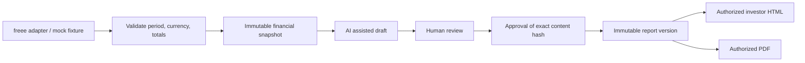

# Prorium Monthly Shareholder Report — Phase 1

## Outcome and scope

The first deliverable is a polished Japanese August 2026 investor report using synthetic data only. In 30 seconds investors see revenue, operating profit, ordinary profit, cash and a reviewed executive summary. In three minutes they can understand YoY movements, business drivers, AI revenue and efficiency, forward indicators and risks.

This repository implements a runnable mock product, including authenticated investor/admin routes, archive, editing, mock import, mock AI drafting, review/approval/publication, revision, audit and PDF. A database schema is provided and tested locally; external Supabase, freee, live AI and production deployment are separate integration work. Mock status remains visible on screen and in PDF. No real data or credentials are used.

## 1. Architecture

Next.js App Router + TypeScript. Server Components perform authorization before fetching reports. Small client components handle chart selection, navigation, editing and downloads. A server-only repository provides a development JSON store with serialized writes and atomic replacement. It is single-process, mock-only storage, not a production database.

Domain types and calculations do not depend on a provider. Import and analysis provider interfaces permit freee and an AI provider later. Current adapters use synthetic fixtures and deterministic text. AI output never transitions to approved or published.

Future production: separate Supabase projects for development/staging/production, Supabase Auth with invite-only accounts and admin MFA, PostgreSQL RLS, server-only freee OAuth tokens, server-side AI jobs and private PDF storage. Investor requests use their own verified access token and RLS; a service key never enters a browser bundle.

## 2. Database schema

`database/schema.sql` is a proposed Supabase-compatible schema, not an applied migration. Generate actual migrations with the Supabase CLI in an isolated development project when integration starts.

| Table                     | Purpose and critical fields                                            |
| ------------------------- | ---------------------------------------------------------------------- |
| profiles                  | auth user identity and display name; no self-managed role              |
| private.admin_memberships | trusted server-provisioned admin membership                            |
| investor_grants           | user, company, grant/revocation timestamp                              |
| reports                   | company, monthly period, unique company-period                         |
| import_jobs               | source, synthetic flag, validation result, state                       |
| financial_snapshots       | immutable period, JPY data, source provenance, checksum                |
| report_versions           | report, snapshot, version, state, investor-safe content JSON, checksum |
| approval_events           | version, reviewer, approved checksum, timestamp                        |
| analysis_runs             | internal AI draft, provider/model, input checksum; admin only          |
| audit_logs                | append-only actor/action/record metadata; no raw financial payload     |

Store values in integer JPY; format as millions of yen on screen. YoY compares the same month, never sequential months. Zero or negative baselines display a delta, not a misleading percentage. Operating margin movement uses percentage points. cash is an end-of-month balance.

Future indicators have a mandatory enum: Actual, Committed, Forecast, Pipeline. A forecast or pipeline must not enter actual revenue totals. Version labels are `v1.0`, `v1.1`, `v2.0`; internal IDs are independent of labels. Published versions and their source snapshots never update or delete, even for an admin. Revisions clone into a new draft. Re-imports create new snapshots.

## 3. Security model

- Development accepts synthetic data only. There is no production URL or key in this repo.
- The mock runtime is enabled only in development or explicit `PRORIUM_ENV=mock`. A production build without that flag cannot authenticate or access mock reports.
- Mock sessions use a process-random HMAC key, HttpOnly/SameSite cookies, expiry and server-side role validation. Demo identities/passwords are intentionally public; they are not production authentication. A restart revokes sessions.
- Authorization is enforced at page, action, repository and PDF boundaries. Investor reads select only published versions. Preview/draft/admin/import/audit require an admin session. UI visibility is never the permission check.
- Every mutation uses Next.js Server Actions (origin checks), validates input and checks roles. Editing resets review/approval. Approving requires a review state; publishing requires approval of the same content hash. No automatic AI publication.
- PostgreSQL RLS is enabled on all report tables. Grant revocation takes effect via database lookup, not user-editable JWT metadata. Investor cannot read draft versions, snapshots, imports, approvals or audits. Private security-definer lookup functions are narrow, pinned to an empty search path and have explicit execute grants.
- SQL triggers enforce immutable publications/snapshots and append-only audit events. Client writes to membership/approvals/publication are revoked. A narrowly scoped backend worker must still pass workflow triggers.
- PDFs require authorization; the browser targets a configured loopback origin, carries only the current session cookie and uses local assets. PDF requests never use untrusted Host headers as destinations.
- Personalized reports are dynamic and have private/no-store responses. No public report URLs, social previews with financial data, or public storage buckets.

## 4. UI information architecture

The report uses a fixed, restrained left rail on desktop and a compact mobile drawer. The investor archive is separate from administration. The header displays period, reporting basis, version and PDF. At the top: four large financial KPI cards, current value, YoY, status and a clearly labeled mock provenance strip. Then a short AI assisted executive summary reviewed by management.

01 Executive Summary → 02 Financial Performance → 03 Why It Changed → 04 Business Highlights → 05 AI Transformation → 06 Financial Position → 07 Forward Indicators → 08 Risks & Actions → 09 CEO Commentary.

Revenue trend compares the selected year with the prior year and uses minimal axes. Driver bridges reconcile exactly with total movements. AI as Revenue and AI as Efficiency have distinct cards and explain contribution versus attribution estimates. Risks pair likelihood/impact with action, owner and date. The CEO closes with a brief human statement. All example claims are synthetic.

## 5. Component structure

- `src/components/shell.tsx`: brand, global navigation, responsive rail, identity.
- `src/components/report/`: report renderer, KPI cards, provenance, executive summary, trend chart, driver bridges, AI impact, remaining sections, PDF action.
- `src/components/admin/`: editor, workflow controls, synthetic import.
- `src/lib/domain/`: models, calculation, validation, workflow and AI/import contracts.
- `src/lib/server/`: mock guard, signed sessions, authorization, repository and PDF.
- `src/app/`: the requested routes with guarded server data access.
- `database/`: proposed schema; `tests/`: domain, SQL/RLS and browser verification.

## 6. Implementation sequence and acceptance

See `docs/implementation-plan.md`. Build the visible August report before external integration. Acceptance includes desktop/tablet/375px mobile, archive and chart interactions, anonymous/investor/admin boundaries, no draft leaks, all workflow transitions, immutable revisions, validation failures, visible mock attribution, and a readable multi-page PDF.

## Decisions and limits

The brief is treated as authorization to build this local mock product; design and plan are recorded before code. No external project is created or production changed. Credentials, live synchronization and live model generation are deliberately integration boundaries. The local mock store serializes writes within one process; production must replace it with transactional PostgreSQL. The mock permits one administrator to exercise all review steps; production should enforce separate author/reviewer and MFA. A nonce-based production CSP is required when the production adapter is introduced; the present development CSP allows Next.js runtime scripts and hot reload.
